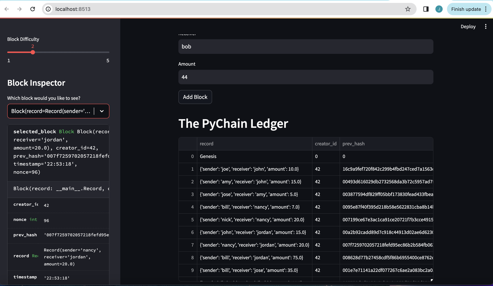

# PyChain Ledger
This project implements a basic blockchain ledger system called PyChain. The provided Python file contains the necessary code to create and manage the PyChain ledger.

## Updates Made
The following updates were made to the provided Python file for this project:

### Step 1: Create a Record Data Class
Created a new data class named Record to serve as the blueprint for the financial transaction records stored in the PyChain ledger.
### Step 2: Modify the Existing Block Data Class
Replaced the generic data attribute in the Block data class with a record attribute of type Record to store financial transaction records.
### Step 3: Add Relevant User Inputs to the Streamlit Interface
Added input areas to the Streamlit application to collect sender, receiver, and amount values for each financial transaction stored in the PyChain ledger.
### Step 4: Test the PyChain Ledger by Storing Records
Tested the complete PyChain ledger functionality by running the Streamlit application and storing multiple financial transaction records in the ledger.
## Usage
 - Navigate to the project folder where the Python file is located.
- Run the Streamlit application by executing streamlit run pychain.py in the terminal.
- Enter sender, receiver, and amount values in the Streamlit interface and click the "Add Block" button to store financial transaction records in the PyChain ledger.
- Verify the stored blocks and their hashes in the Streamlit drop-down menu.
- Test the blockchain validation process by using the web interface to ensure the integrity of the PyChain ledger.
## Screenshots
Image showing the individuals blocks in the PyChain Ledger in the Streamlit app.

Image showing the validation of the blockchain.
